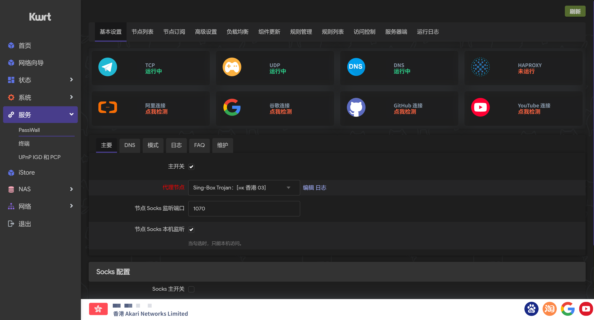
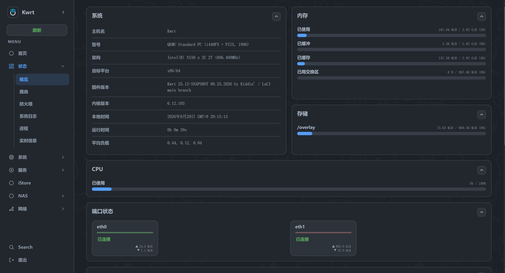
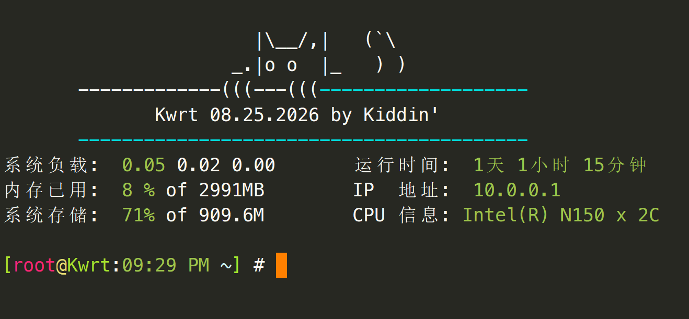

#### 固件下载与在线定制: [openwrt.ai](https://openwrt.ai)

### openwrt 软路由固件

#### 基于官方openwrt-25.12最新稳定分支, 并基于国内使用喜欢做大量优化

#### 原生极致纯净, 固件默认只包含基础上网功能, 后台在线选装插件, 或在线定制包含指定插件的固件

#### 自建在线插件仓库 [dl.openwrt.ai](https://dl.openwrt.ai), 额外收录三方插件1000+, 插件库日更

##### TG群: [Kwrt交流群](https://t.me/opkwrt)

## Acknowledgments

- [OpenWrt](https://github.com/openwrt/openwrt)
- [Lean's OpenWrt](https://github.com/coolsnowwolf/lede)
- [ImmortalWrt](https://github.com/immortalwrt/immortalwrt)
- [iStoreOS](https://github.com/istoreos)
- [unifreq](https://github.com/unifreq/openwrt_packit)
- [ophub](https://github.com/ophub/amlogic-s9xxx-openwrt)
- [hanwckf](https://github.com/hanwckf/immortalwrt-mt798x)
- [aparcar](https://github.com/openwrt/asu)
- [GitHub](https://github.com)
- [GitHub Actions](https://github.com/features/actions)

